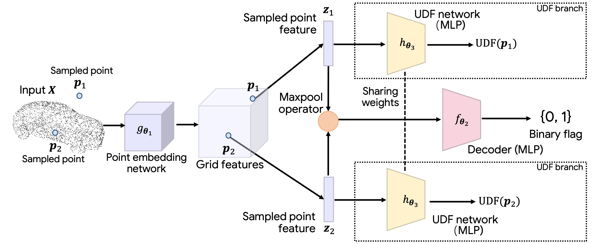
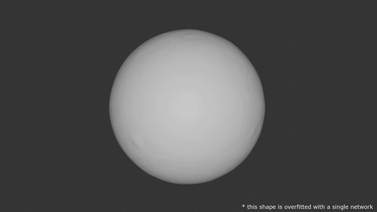
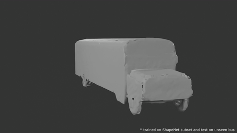

# GIFS

This repository is the official implementation for GIFS introduced in the paper:

> GIFS: Neural Implicit Function for General Shape Representation  
> [_Jianglong Ye_](https://jianglongye.com/), [_Yuntao Chen_](https://scholar.google.com/citations?user=iLOoUqIAAAAJ), [_Naiyan Wang_](https://winsty.net/), [_Xiaolong Wang_](https://xiaolonw.github.io/)  
> CVPR, 2022

[Project Page](https://jianglongye.com/gifs/) / [ArXiv](https://arxiv.org/abs/2204.07126) / [Video](https://youtu.be/71luhEF75T0)

<div align="center">
  
</div>

## Visualization

|   Multi-layer ball   | Bus with seats inside |
| :------------------: | :-------------------: |
|  |    |

## Table of Content

- [Environment Setup](#environment-setup)
- [Demo](#demo)
- [Data Preparation](#data-preparation)
- [Run](#run)
- [Citation](#citation)
- [Acknowledgement](#acknowledgement)

## Environment Setup

PyTorch with CUDA support are required, please follow the [official installation guide](https://pytorch.org/get-started/locally/).

(Our code is tested on python 3.9, torch 1.8.0, CUDA 11.1 and RTX 3090)

Besides, following libraries are used in this project:

```sh
configargparse
trimesh
tqdm
numba
scipy # for data preparation
point_cloud_utils # for data preparation

wandb # (optional, for training)
```

Installation instruction:

```sh
pip install configargparse trimesh tqdm numba scipy point_cloud_utils wandb
```

## Demo

Download our pretrained model from [here](https://drive.google.com/drive/folders/1RPhi2EqCw2NnlPAusohCeZiW136XpHsL?usp=sharing) and put it in the `PROJECT_ROOT/experiments/demo/checkpoints` directory. Note that there is no need to unpack the tar file, the full path should be `PROJECT_ROOT/experiments/demo/checkpoints/checkpoint_44h:0m:56s_158456.50156092644.tar`. On some platforms, the colon (`:`) in the filename may be replaced by other symbols like a space (` `), please rename it back.

Run demo with the following command:

```sh
python generate.py --config configs/demo.txt
```

Some meshes are generated in the `PROJECT_ROOT/experiments/demo/evaluation/generation/` directory. You can check them in [meshlab](https://www.meshlab.net/). Note that we do not make normals from neighbouring faces point to the same direction, so you may need to enable the `back face -> double` option in meshlab for better visualization.

## Data Preparation

To reproduce our experiments, please download the raw [ShapeNetCore v1](https://shapenet.org/) dataset and unzip it into the `PROJECT_ROOT/datasets/shapenet/data` directory.

### Compile the Label Generation Code

Our GT label generation code depends on [CGAL](https://www.cgal.org/) which can be installed on ubuntu by following command (or other ways):

```sh
apt install libcgal-dev
```

Compile the label generation code with following commands:

```sh
cd PROJECT_ROOT/dataprocessing/intersection_detection/
mdkir build
cd build
cmake -DCMAKE_BUILD_TYPE=Release ..
make
```

Or, we provide a precompiled binary file (static linking) for ubuntu which can be downloaded from [here](https://drive.google.com/drive/folders/12tprVMHvNpE0OwyW1g5HAkE2SdVndCj4?usp=sharing). After downloading, put the binary file to `PROJECT_ROOT/dataprocessing/intersection_detection/build/` and change the permission of the binary file:

```sh
chmod +x intersection
```

### Data Processing

Run the following command to process the data:

```sh
export PYTHONPATH=.
python dataprocessing/create_split.py --config configs/shapenet_cars.txt
python dataprocessing/preprocess.py --config configs/shapenet_cars.txt
```

## Run

We provide a pretrained model [here](https://drive.google.com/drive/folders/1RPhi2EqCw2NnlPAusohCeZiW136XpHsL?usp=sharing). Please put it into the corresponding directory according to the config file you are using.

### Training

Run the following command to train the model:

```sh
python ddp_train.py --config configs/shapenet_cars.txt
```

### Generation

Run the following command to generate meshes:

```sh
python generate.py --config configs/shapenet_cars.txt
```

## Citation

```bibtex
@inproceedings{ye2022gifs,
  title={GIFS: Neural Implicit Function for General Shape Representation},
  author={Ye, Jianglong and Chen, Yuntao and Wang, Naiyan and Wang, Xiaolong},
  booktitle={Proceedings of the IEEE/CVF Conference on Computer Vision and Pattern Recognition},
  year={2022}
}
```

## Acknowledgement

The code is based on [NDF](https://github.com/jchibane/ndf/), thanks for the great work!
